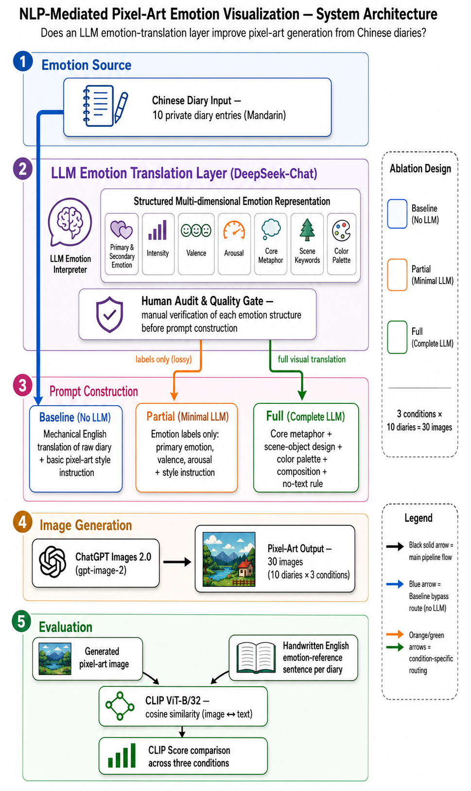
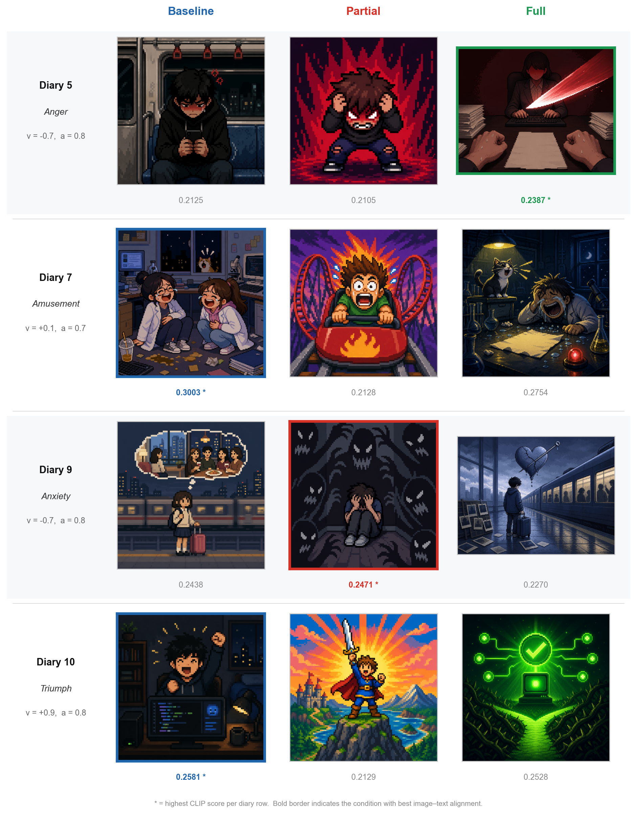

# emotion-pixel-viz

**中文日记 → LLM 情绪提取 → 像素艺术图像**

将一篇中文日记通过大语言模型（DeepSeek）结构化解析情绪，分三种条件生成像素艺术图像，并用 CLIP 评分量化图文情绪对齐程度。

---

## Pipeline

```
中文日记
  └─→ DeepSeek-Chat
        情绪结构化提取（valence / arousal / 核心隐喻 / 色彩 / 场景意象）
        └─→ 三条件 Prompt 构造
              ├─ Baseline   原始日记直译 + 像素风格约束
              ├─ Partial    仅情绪标签 + valence/arousal（无视觉锚点）
              └─ Full       完整结构化 prompt（隐喻 + 色彩 + 场景 + 情绪）
                  └─→ 图像生成（DALL-E 3 / ChatGPT Images）
                        └─→ CLIP 评分（openai/clip-vit-base-patch32）
```

---

## 系统架构



---

## 实验结果

10 篇日记 × 3 条件 = 30 张像素图，CLIP 余弦相似度（vs. 手写英文情绪参考句）：

| 条件 | CLIP 均值 | vs Baseline |
|------|-----------|-------------|
| Baseline | 0.2530 | — |
| **Full** | **0.2593** | **+2.5%** |
| Partial | 0.2163 | −14.5% |

- Full > Baseline：10 篇中 5 篇
- Full > Partial：10 篇中 9 篇
- **核心发现**：Partial 垫底——抽象情绪标签缺乏视觉锚点，Full 提供的隐喻和色彩信息对图像情绪传达有帮助，但优势幅度有限（+2.5%）

### 三条件生成结果对比（diary_5 / 7 / 9 / 10）



### CLIP 分数热力图（10 × 3）


### 条件均值与逐日折线


---

## 快速开始：用你自己的日记生成像素图

### 1. 安装依赖

```bash
python -m venv venv
source venv/bin/activate      # Windows: venv\Scripts\activate
pip install -r requirements.txt
```

### 2. 配置 API Key

```bash
cp .env.example .env
```

编辑 `.env`：

```
DEEPSEEK_API_KEY=sk-xxx    # https://platform.deepseek.com
OPENAI_API_KEY=sk-xxx      # https://platform.openai.com（DALL-E 3 需 Tier 1+）
```

### 3. 运行 Demo

```bash
# 使用内置示例日记
python scripts/run_demo.py

# 使用你自己的日记（UTF-8 中文文本文件）
python scripts/run_demo.py --diary my_diary.txt
```

生成的三张像素图保存在 `outputs/demo/`。

---

## 批量实验复现

若需完整复现 10 篇日记的消融实验：

```bash
# 1. 准备日记数据（格式见下方）
#    将 data/diaries.txt 替换为你自己的日记集

# 2. 情绪提取
python scripts/extract_emotions.py

# 3. 人工审计情绪 JSON（可选，提升 prompt 质量）
python scripts/audit_emotions.py

# 4. 三条件 Prompt 构造
python scripts/build_prompts.py

# 5. 生成图像后运行 CLIP 评估
python scripts/evaluate_clip.py

# 6. 统计分析与可视化
python scripts/analyze_results.py
```

**日记格式**（`data/diaries.txt`）：

```
1. 标题（可留空）
日记正文……

2. 标题（可留空）
日记正文……
```

---

## 目录结构

```
scripts/
  run_demo.py              端到端单条日记演示（DALL-E 3）
  extract_emotions.py      DeepSeek 情绪提取
  audit_emotions.py        情绪 JSON 人工审计
  build_prompts.py         三条件 Prompt 构造
  evaluate_clip.py         CLIP 图文对齐评分
  analyze_results.py       统计分析与可视化
  generate_report_figures.py  论文配图生成
prompts/
  emotion_extraction_prompt.txt  DeepSeek 系统 prompt
outputs/
  clip_scores.csv              实验数据
  gpt-architecture.png         系统架构图（图1）
  figure_qualitative_gallery.png  三条件生成对比 Gallery（图2）
  figure_clip_heatmap.png      CLIP 分数热力图（图3）
  figure_clip_delta.png/svg    ΔCLIP 消融效果图（图4）
  clip_analysis.png            条件均值与逐日折线
  condition_baseline/          Baseline 条件生成图（10 张）
  condition_partial/           Partial 条件生成图（10 张）
  condition_full/              Full 条件生成图（10 张）
```

---

## 理论框架

- **Russell (1980)** Circumplex Model of Affect：效价（valence）× 唤起度（arousal）二维情绪坐标
- **Leventhal (1979)** Hierarchical Processing Model：三层情绪分解（感觉运动 / 图式 / 概念）

## 主要依赖

| 组件 | 版本/来源 |
|------|-----------|
| 情绪提取 LLM | DeepSeek-Chat |
| 图像生成（研究） | ChatGPT Images 2.0（gpt-image-2，OpenAI，2026年4月） |
| 图像生成（Demo） | DALL-E 3 via OpenAI API |
| CLIP 评估 | openai/clip-vit-base-patch32（Hugging Face） |
| 机械翻译 | Google Translate（deep-translator） |

---

## 局限性

- 样本量 n=10，统计功效有限，结论为探索性发现
- CLIP 参考文本由研究者手动编写，存在潜在确认偏误
- 图像生成跨会话进行，无法完全排除模型上下文记忆对生成顺序的影响
- Full 均值优势（+2.5%）较小，研究者主观评估与 CLIP 量化结论存在分歧，不以主观判断作为结论依据
