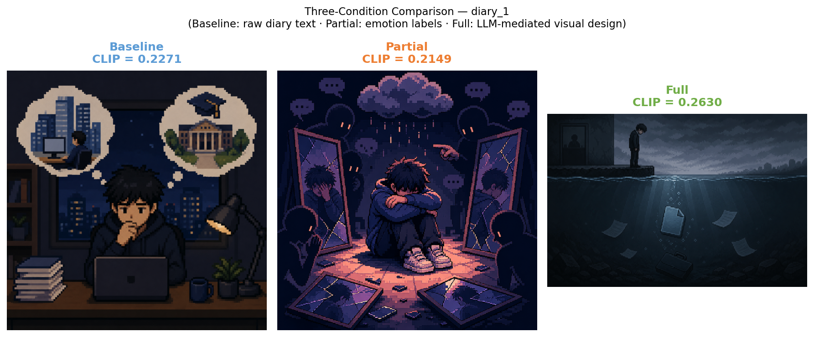
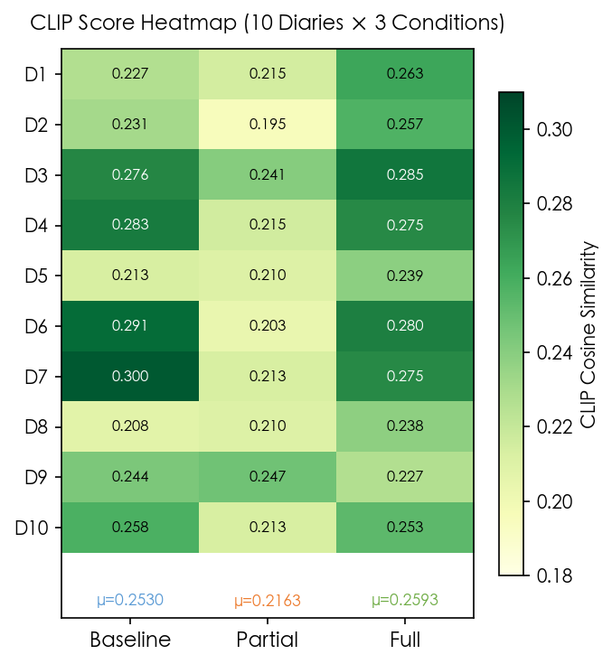
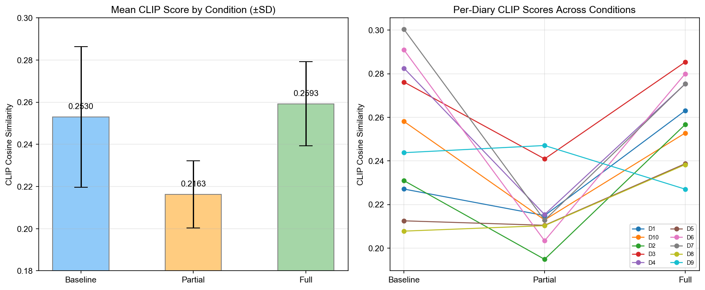

# 基于大语言模型的中文情绪日记像素艺术可视化研究

---

## 一、背景与项目介绍

情绪表达与视觉艺术之间的桥梁历来依赖创作者的主观经验，难以标准化或规模化。近年来，大语言模型（LLM）在自然语言理解方面取得显著突破，能够从非结构化文本中提取细粒度的情绪信息。与此同时，图像生成模型的快速发展使得"文本到图像"的自动创作成为可能。

本项目提出一个 **NLP 中介的多模态生成管线**，以中文私人日记为输入，探索 LLM 能否作为情绪解读与视觉生成之间的有效中间层。核心研究问题为：

> **LLM 中间层的介入，是否能使生成的像素艺术图像更准确地传达日记作者的情绪？**

本研究采用三条件消融实验设计，通过 CLIP 图文对齐评分量化评估不同程度 LLM 介入对情绪传达质量的影响，为多模态情感计算提供实证依据。

---

## 二、相关领域工作

**情感计算（Affective Computing）**：Picard（1997）最早系统提出机器理解与表达情绪的研究框架，此后情绪识别逐步从生理信号扩展到文本、语音和图像等多模态。

**LLM 情绪分析**：近期研究探索了大语言模型在情绪对话理解任务上的能力，结果表明现阶段模型已具备一定的情绪识别潜力，但在细粒度情感推理方面仍有提升空间（Zhao et al., 2023）。本项目利用 DeepSeek-Chat 通过系统性 prompt 设计引导模型输出结构化多维情绪分析，而非直接依赖其零样本情绪判断能力。

**文本到图像生成**：DALL-E、Stable Diffusion 等模型已广泛用于艺术创作辅助。研究表明，不同类型的 prompt 修饰词（如风格词、构图词、主体描述）会显著影响生成图像的视觉特征与内容呈现（Oppenlaender, 2022）。

**CLIP 图文评估**：Radford 等人（2021）提出的 CLIP 模型通过对比学习将图像与文本映射到共享语义空间，其余弦相似度已成为衡量图文语义对齐的标准辅助指标，被广泛用于图像生成质量评估。

---

## 三、项目算法与框架

### 3.1 整体管线

本系统由以下四个阶段构成：

```
中文日记
  └─→ DeepSeek-Chat：结构化情绪分析 → 情绪 JSON
        └─→ 人工审计门禁 → 验证通过的情绪 JSON
              └─→ 条件化 Prompt 构造（三条件）
                    └─→ ChatGPT Images 2.0 → 像素艺术图像
                          └─→ CLIP 评估（图文余弦相似度）
```

### 3.2 情绪结构化提取

以 DeepSeek-Chat 为情绪分析器，从每篇日记中提取多维情绪结构，包括：主情绪与副情绪、情绪强度（intensity）、效价（valence）、唤醒度（arousal）、核心隐喻、视觉场景关键词及色调建议。提取结果经人工审计门禁验证，确保情绪解读的准确性后方可进入下游 prompt 构造阶段。

### 3.3 三条件消融设计

为隔离 LLM 介入程度对图像质量的影响，设计三个对照条件（每条件 × 10 篇日记 = 30 张图）：

| 条件 | LLM 介入 | Prompt 内容 |
|------|---------|------------|
| **Baseline** | 无 | 原始日记机械英译 + 基础像素风格指令 |
| **Partial** | 最小化 | 情绪标签（主情绪、效价、唤醒度）+ 像素风格指令 |
| **Full** | 完整 | 核心隐喻、场景物件设计、色调、构图要求、避免文字指令 |

以 diary_1（求职焦虑日记）为例，三条件 prompt 差异如下：
- **Baseline**：直接输入日记全文英译，包含大量叙事细节（Boss直聘、字节跳动等），无情绪方向
- **Partial**：`anxiety, insecurity, self-doubt, low valence, mid arousal`——仅情绪标签，无视觉指引
- **Full**：`被HR沉默后，投递的简历像石子沉入无声的水面`——隐喻驱动的视觉设计，搭配暗灰/冷调蓝灰色调与无文字指令

所有图像均使用 **ChatGPT Images 2.0**（gpt-image-2，OpenAI，2026年4月）生成，像素艺术风格通过 prompt 工程实现。

图1展示了 diary_1 在三条件下的生成结果及对应 CLIP 分，可直观观察到 Full 条件图像在构图聚焦与情绪意象上的差异：



---

## 四、实验结果

### 4.1 CLIP 评估方法

对每张生成图像，使用 CLIP ViT-B/32 计算图像嵌入向量与对应日记情绪描述文本（英文手写参考句）的余弦相似度，得到 CLIP Score。分数越高，代表图像内容与情绪语义越对齐。

### 4.2 量化结果

| 条件 | 平均 CLIP Score | 较 Baseline |
|------|---------------|-------------|
| Baseline | 0.2530 | — |
| Partial | 0.2163 | **−14.5%** |
| Full | **0.2593** | **+2.5%** |

**Full 条件在 9/10 篇日记中高于 Partial**（diary_9 为唯一例外），**在 5/10 篇中高于 Baseline**，取得三组最高均值。

图2（热力图）呈现了全部 30 张图的 CLIP 分布，Partial 列整体最浅（均值最低），Full 列整体最深（均值最高）；D9 为唯一逆序点（Partial > Full），D4/D6/D7/D9/D10 的 Baseline 得分高于 Full。图3（柱状图 + 折线图）为均值与逐条日记趋势概览。





### 4.3 结果分析

**Full 条件在均值层面最优**：隐喻驱动的视觉设计为图像生成模型提供明确的构图与意象方向，使生成结果在均值层面与日记情绪语义最为对齐。需要指出，Full 与 Baseline 的均值差距仅为 +2.5%，且在逐篇比较中 5/10 篇 Baseline 得分更高，说明 Full 的优势在整体趋势而非每一样本。作者逐图比对后，主观上 Full 条件图像的情绪意象最为聚焦，与均值层面的 CLIP 排名一致。

**Partial 条件意外垫底**：纯粹的情绪标签（如 `anxiety, low valence`）是高度抽象的心理学描述，缺乏可视化锚点，导致图像生成模型难以将其转化为具体视觉元素。相比之下，Baseline 的叙事文本虽然冗余，但其中包含的具体场景信息（物件、场所）为模型提供了隐式视觉线索。

**核心发现**：LLM 介入的价值不在于提供情绪标签，而在于将抽象情绪**转译为视觉隐喻与场景设计语言**——这一中间层转化是提升图像情绪表达质量的关键。

### 4.4 局限性

本研究存在以下方法论局限：(1) 图像均由同一操作者顺序生成（Baseline → Partial → Full），存在 prompt 写作熟练度提升导致的轻微操作者偏差；(2) CLIP ViT-B/32 的训练数据以直观图文配对为主，对日记中具有文学性的隐喻表达（如"包裹在自由外表下的讽刺性焦虑"）的语义理解能力有限，且对像素艺术风格的绝对评分偏低（~0.22），条件间相对排名具有参考价值但不宜过度解读；更大参数量的 CLIP 模型（如 ViT-L/14）对复杂语义的捕捉能力更强，是后续工作的改进方向；(3) 样本量为 10 篇日记，结论的统计功效有限；(4) 本研究仅采用 CLIP Score 一项自动指标，该指标无法评估图像的视觉质量与美学规范性；理想方案还应结合美学评分或人工评估，并计算与 CLIP Score 的相关系数，以佐证自动指标的有效性。

---

*配图生成脚本：`scripts/generate_report_figures.py`；CLIP 评估脚本：`scripts/evaluate_clip.py`；原始数据：`outputs/clip_scores.csv`。*
